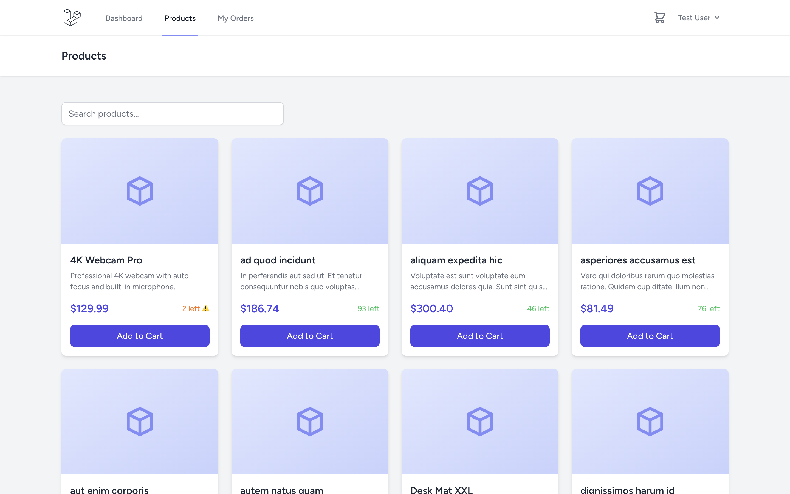
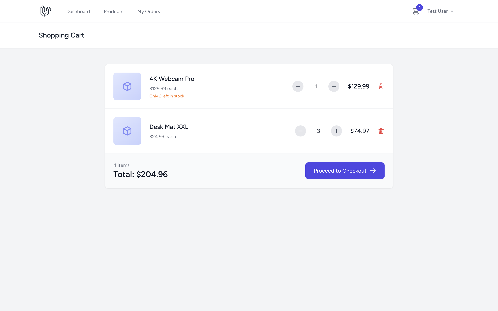
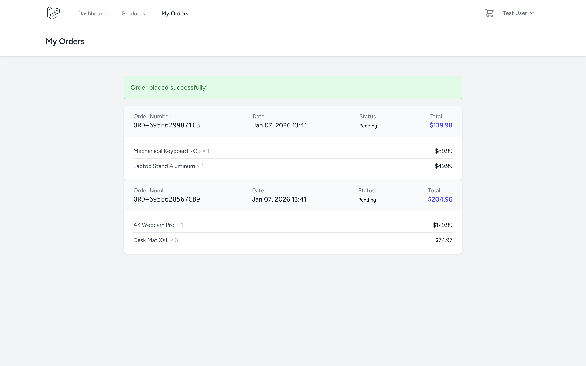
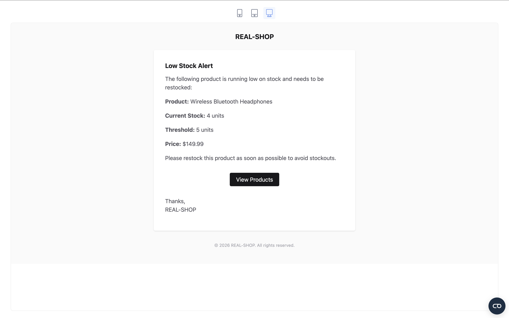
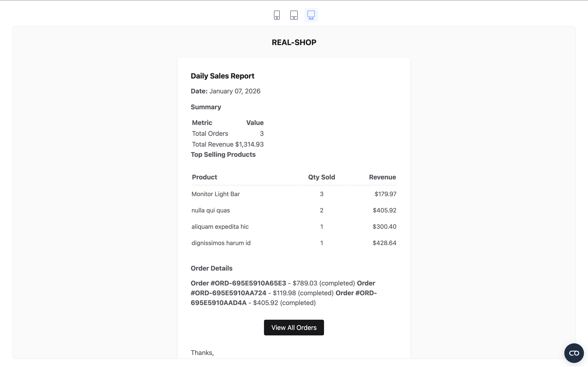

# Real Shop – E-Commerce Shopping Cart

A simple e-commerce shopping cart application built with **Laravel 12** and **Livewire 3**, designed to demonstrate clean architecture, user-based cart persistence, background jobs, and scheduled tasks.

---

## Screenshots

| Product Catalog | Shopping Cart | Order History |
|:---------------:|:-------------:|:-------------:|
|  |  |  |

| Low Stock Email | Daily Sales Report |
|:---------------:|:------------------:|
|  |  |

---

## Features

* 🛒 **Shopping Cart** – Add products, update quantities, and remove items
* 📦 **Product Catalog** – Browse products with search and pagination
* 💳 **Checkout** – Simple checkout flow with order creation
* 📉 **Low Stock Alerts** – Automatic email notifications when stock runs low (via Queue)
* 📊 **Daily Sales Report** – Scheduled command for daily sales summary email
* 🔐 **Authentication** – User registration and login with Laravel Breeze

---

## Tech Stack

* **Framework:** Laravel 12
* **Frontend:** Livewire 3 + Tailwind CSS
* **Database:** MySQL
* **Queue:** Database driver
* **Mail:** SMTP (Mailtrap for development, `log` supported for local testing)

---

## Requirements

* PHP 8.2+
* Composer
* MySQL 8.0+
* Node.js 18+

---

## Installation

```bash
# Clone repository
git clone https://github.com/hijrahassalam/real-shop.git
cd real-shop

# Install backend & frontend dependencies
composer install
npm install

# Environment setup
cp .env.example .env
php artisan key:generate

# Configure database in .env
DB_DATABASE=db_real_shop
DB_USERNAME=your_username
DB_PASSWORD=your_password

# Run migrations and seed sample data
php artisan migrate --seed

# Build frontend assets
npm run build
```

---

## Running the Application

```bash
# Terminal 1 – Web server
php artisan serve

# Terminal 2 – Queue worker (required for emails)
php artisan queue:work
```

Visit: [http://localhost:8000](http://localhost:8000)

---

## Test Accounts

| Email                                         | Password | Role  |
| --------------------------------------------- | -------- | ----- |
| [admin@example.com](mailto:admin@example.com) | password | Admin |
| [test@example.com](mailto:test@example.com)   | password | User  |

> The admin account is used only as a **dummy email recipient** for
> low stock alerts and daily sales reports.

---

## Key Features Explained

### 1. Shopping Cart

* Guest users are redirected to login
* Cart data is persisted in the database and associated with authenticated users
* Real-time cart updates using Livewire
* Stock validation is enforced before checkout

### 2. Low Stock Notification

* Implemented using the **Eloquent Observer** pattern
* Triggered automatically when product stock falls below a configurable threshold (default: 5)
* Email delivery is handled asynchronously via a queued job
* Admin email is configurable via `MAIL_ADMIN_ADDRESS`

```php
// Triggered automatically when stock falls below threshold
// See: app/Observers/ProductObserver.php
```

### 3. Daily Sales Report

* Implemented as an Artisan command:
  `php artisan report:daily-sales`
* **Scheduled to run daily in the evening (20:00 server time)**
* Includes:

  * Order summary
  * Top-selling products
  * Order details for the selected day

```bash
# Run manually
php artisan report:daily-sales

# Run for a specific date
php artisan report:daily-sales --date=2026-01-07
```

---

## Design Decisions

* **Orders & Order Items**

  * The `orders` and `order_items` tables are introduced to clearly define when a product is considered *sold*.
  * This avoids ambiguity from abandoned carts and simplifies daily sales reporting.

* **User-Based Cart Persistence**

  * Shopping carts are stored in the database and associated with authenticated users rather than using session or local storage.
  * This ensures consistency across devices and aligns with real-world e-commerce behavior.

* **Low Stock Notification via Observer**

  * An Eloquent Observer is used to decouple stock-related side effects from controllers.
  * This guarantees that low stock alerts are triggered consistently whenever stock changes, regardless of where the update originates.

* **Asynchronous Email Delivery**

  * Email notifications are dispatched via queued jobs to avoid blocking critical flows such as checkout.
  * The database queue driver is chosen for simplicity and ease of local review.

* **Scheduled Daily Sales Report**

  * The sales report is implemented as an Artisan command and executed via Laravel’s scheduler.
  * This allows the report to be triggered manually for debugging or automatically in production via cron.

* **Minimal Frontend Layer**

  * Livewire is used to minimize frontend complexity while still providing a reactive user experience.
  * This keeps the focus on backend logic, data integrity, and Laravel best practices.

---

## Project Structure

```
app/
├── Console/Commands/
│   └── SendDailySalesReport.php       # Daily sales report command
├── Jobs/
│   └── SendLowStockNotification.php   # Queued notification job
├── Livewire/
│   ├── Cart/
│   │   ├── CartIcon.php               # Cart icon with counter
│   │   └── CartPage.php               # Shopping cart page
│   ├── Checkout/
│   │   └── CheckoutPage.php           # Checkout flow
│   ├── Orders/
│   │   └── OrderList.php              # Order history
│   └── Products/
│       └── ProductList.php            # Product catalog
├── Mail/
│   ├── DailySalesReport.php           # Daily report email
│   └── LowStockAlert.php              # Low stock alert email
├── Models/
│   ├── Cart.php
│   ├── CartItem.php
│   ├── Order.php
│   ├── OrderItem.php
│   ├── Product.php
│   └── User.php
└── Observers/
    └── ProductObserver.php            # Stock change observer
```

---

## Environment Variables

```env
# Mail configuration
MAIL_MAILER=smtp
MAIL_HOST=sandbox.smtp.mailtrap.io
MAIL_PORT=2525
MAIL_USERNAME=your_mailtrap_username
MAIL_PASSWORD=your_mailtrap_password
MAIL_ADMIN_ADDRESS=admin@yourcompany.com

# Queue
QUEUE_CONNECTION=database
```

> For local testing, `MAIL_MAILER=log` can be used to inspect emails via
> `storage/logs/laravel.log`.

---

## Scheduler Setup (Production)

Add the following entry to crontab:

```bash
* * * * * cd /path/to/real-shop && php artisan schedule:run >> /dev/null 2>&1
```

---

## Database Schema (Simplified)

```
users
├── id, name, email, password

products
├── id, name, description, price, stock_quantity, low_stock_threshold, image, is_active

carts
├── id, user_id

cart_items
├── id, cart_id, product_id, quantity, price

orders
├── id, user_id, order_number, status, total

order_items
├── id, order_id, product_id, quantity, price
```

---

## License

MIT License
